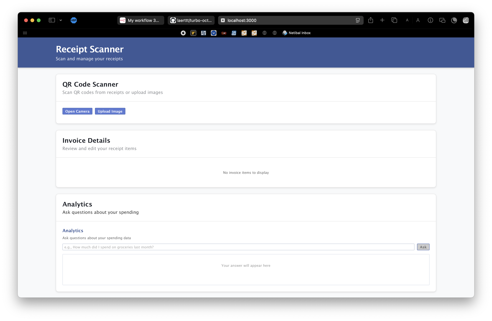
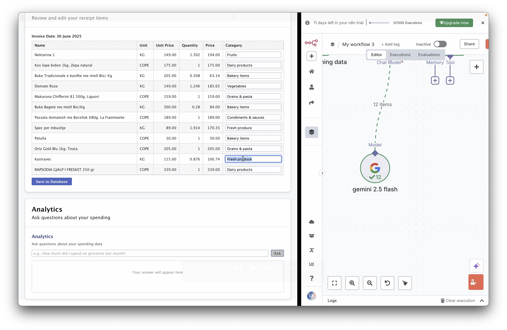
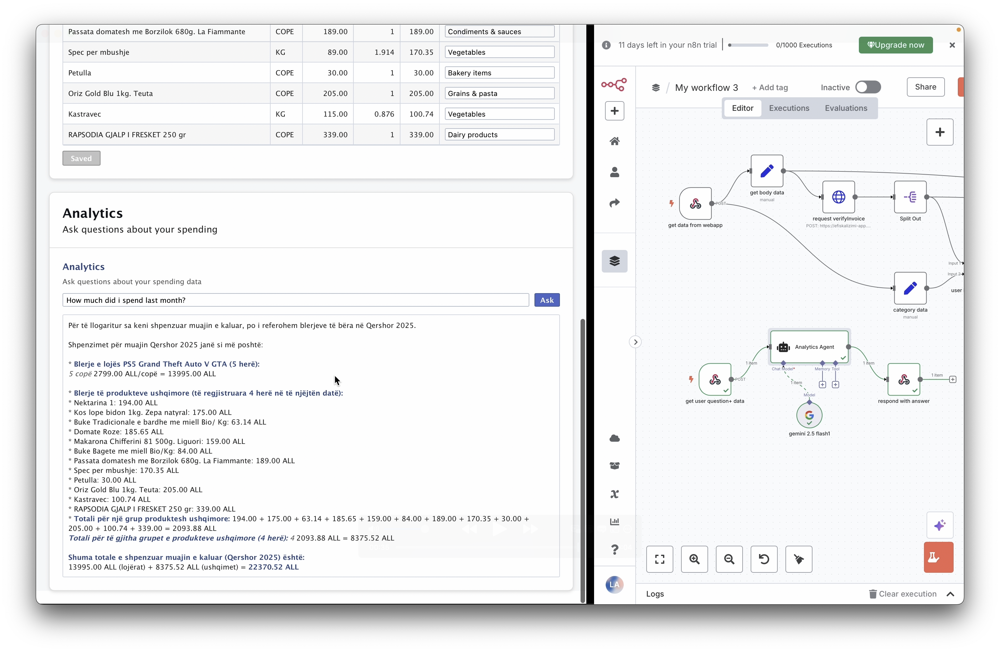

## Receipt Scanner & Analytics App

A React + Node.js application that lets users upload or scan receipt QR codes, view and categorize receipt items (powered by a LLM), manually correct categories to improve the model, and save receipts into a MySQL database. The Analytics section allows you to query your saved receipts (e.g. "How much did I spend last month?", "What was the price of coffee?").

---
### 🪧 Screenshots & Demos
#### 1. No QR Code scanned yet

#### 2. Editing categories

#### 3. Asking for analytics

#### Extra long demo gif


---
### 🚀 Features

* **Upload or Scan QR codes** via camera or file upload
* **LLM-based item categorization** with manual override to improve accuracy
* **Persistent storage** of receipts and items in MySQL
* **Analytics interface**: Ask natural-language questions about your spending history

---

## 📋 Prerequisites

1. **Git** (to clone the repo)
2. **Node.js** (v14+)
3. **npm** or **yarn**
4. **MySQL** (local instance)
5. **n8n** (automation & webhook orchestration)

---

## 🔧 Installation & Setup

1. **Clone the repository**

   ```bash
   git clone https://github.com/your-org/receipt-scanner.git
   cd receipt-scanner
   ```

2. **Configure the Server**

   * Copy and rename the example env file:

     ```bash
     cp server/.env.example server/.env
     ```
   * Open `server/.env` and fill in your MySQL connection details:

     ```env
     DB_HOST=localhost
     DB_USER=your_db_user
     DB_PASSWORD=your_db_password
     DB_NAME=receipt_db
     ```

3. **Configure the Webapp & n8n**

   * In the project root, copy and rename the template:

     ```bash
     cp .env.template .env
     ```
   * Open `.env` and:

     1. Paste the **Get Data from Webapp** webhook URL from your n8n workflow.
     2. Paste the **Get User Question + Data** webhook URL into `server/.env` if not already there.

4. **Import n8n Workflow**

   1. Start n8n: `n8n start`
   2. In the n8n UI, import `workflow.json` from the project root.
   3. You’ll see two entry points:

      * **Get Data from Webapp**
      * **Get User Question + Data**
   4. Copy each entry’s webhook URL into the appropriate `.env` variables.

5. **Install dependencies** in both directories

   ```bash
   # In project root
   npm install

   # In server directory
   cd server && npm install && cd ..
   ```

---

## ▶️ Running the App

1. **Start the server**

   ```bash
   cd server
   npm start
   ```

2. **Start the React frontend**

   ```bash
   cd ..
   npm start
   ```

Frontend will be available at `http://localhost:3000` by default.

---

## 📈 Usage

1. **Upload** a receipt QR image or **scan** via camera.
2. After scanning, the app shows:

   * The original receipt URL
   * A table of items with auto-generated categories
3. **Edit** any incorrect categories directly in the table.
4. Click **Save to Database** to persist the receipt and items.
5. Switch to the **Analytics** tab to ask natural-language questions about your spending:

   * "How much did I spend last week?"
   * "What was the cost of item X?"
   * "Show me all groceries in March 2025"

---

## 🤝 Contributing

Contributions are welcome! Please open an issue or submit a pull request.

---

## 📄 License

[MIT](LICENSE)
